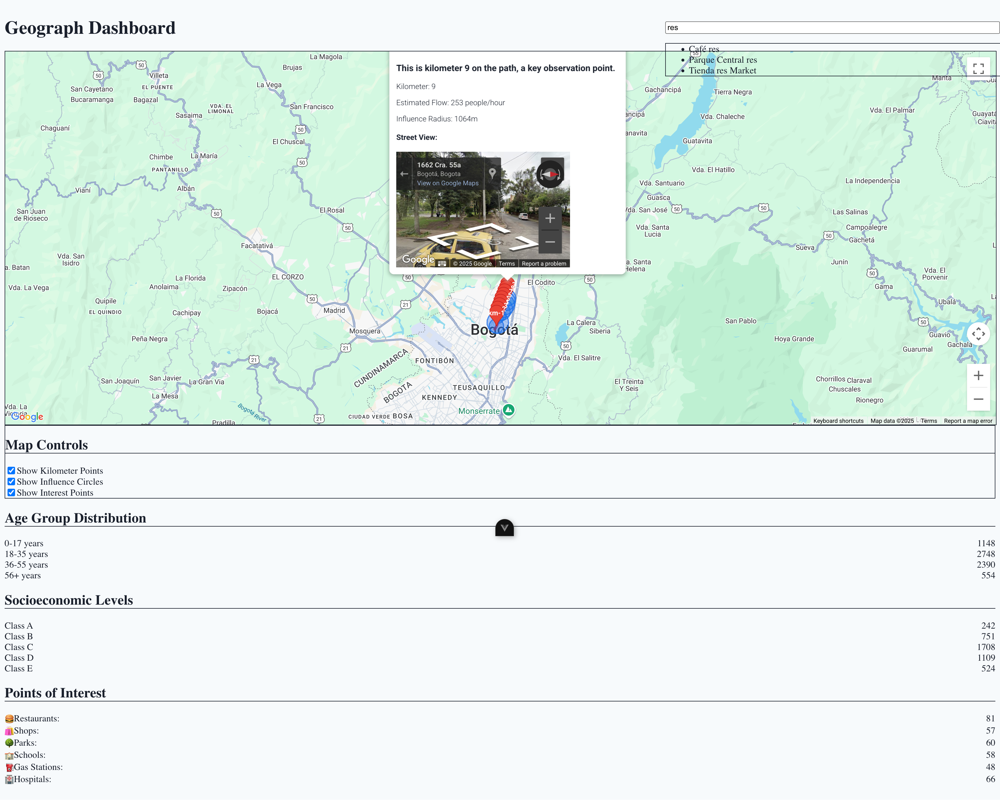

# [Maps Dashboard]



## Table of Contents

- [About The Project](#about-the-project)
- [Features](#features)
- [Getting Started](#getting-started)
  - [Prerequisites](#prerequisites)
  - [Installation](#installation)
  - [Environment Variables](#environment-variables)
  - [Compile and Hot-Reload for Development](#environment-variables)

## About The Project

This project is a modern, interactive web dashboard designed to visualize geospatial data, track paths, display points of interest, and analyze demographic/socioeconomic information. Built with Vue 3 and Vite, it leverages the Google Maps JavaScript API to provide a rich, responsive, and intuitive user experience. The dashboard aims to provide insights into geographical data trends and specific locations.

## Features

- **Interactive Google Map:** Displays geographical data with customizable controls.
- **Path Visualization:** Renders GPS traces or predefined routes on the map.
- **Dynamic Map Controls:** Toggle visibility of:
  - Kilometer Points
  - Influence Circles
  - Points of Interest (POIs)
- **Advanced Markers:** Utilizes `google.maps.marker.AdvancedMarkerElement` for performant and customizable map markers.
- **Street View Integration:** View Street View panoramas for clicked map points.
- **Information Windows:** Displays detailed information about clicked map elements (markers, circles).
- **Data Visualization Widgets:**
  - Age Group Distribution Chart
  - Socioeconomic Levels Chart
  - Points of Interest Panel
- **Search Bar:** Allows searching for addresses directly from the header.

## Getting Started

To get a local copy up and running, follow these simple steps.

### Prerequisites

Before you begin, ensure you have the following installed:

- Node.js (v18 or higher recommended)
- npm or Yarn

You will also need a **Google Maps JavaScript API Key** with the following services enabled:

- Maps JavaScript API
- Street View Static API
- Street View Service

### Installation

1.  **Clone the repo:**
    ```bash
    git clone [https://github.com/](https://github.com/)[YOUR_GITHUB_USERNAME]/[YOUR_PROJECT_NAME].git
    cd [YOUR_PROJECT_NAME]
    ```
2.  **Install NPM packages:**
    ```bash
    npm install
    # or
    yarn install
    ```

### Environment Variables

Create a `.env` file in the root of your project and add your Google Maps API Key:

```bash
VITE_GMAPS_API_KEY=***
```

### Compile and Hot-Reload for Development

```sh
npm run dev
```

### Type-Check, Compile and Minify for Production

```sh
npm run build
```

### Run Unit Tests with [Vitest](https://vitest.dev/)

```sh
npm run test:unit
```

### Run End-to-End Tests with [Cypress](https://www.cypress.io/)

```sh
npm run test:e2e:dev
```

This runs the end-to-end tests against the Vite development server.
It is much faster than the production build.

But it's still recommended to test the production build with `test:e2e` before deploying (e.g. in CI environments):

```sh
npm run build
npm run test:e2e
```

### Lint with [ESLint](https://eslint.org/)

```sh
npm run lint
```
